# 💡 Secured AI Agents with Privacy & Safety Filters

**💡 Project Summary:** This AI messaging pipeline uses 🛡️ Privacy-Filter, ☠️🔞 Content Moderation, and 🧠 LLM Summarization to sanitize, flag, and summarize messages while logging all actions for traceability.

<h4>🔗 AI Agent Code</h4>

- 🏃 **Github Code**: [Open in Github](https://github.com/Shibli-Nomani/Secured-AI-Agents-with-Privacy-and-Saftey-Filter/blob/master/Secured_AI_Agents_with_Privacy_and_Safety_Filters.ipynb)  
- 🚀 **Colab Code**: [Open in Colab](https://colab.research.google.com/drive/1xi1PclScl8TXrmWuJsRsYW0Ryw0L8FFk?usp=sharing)  
- 📊 **Kaggle Code**: [Open in Kaggle](https://www.kaggle.com/code/shiblinomani/secured-ai-agents-with-privacy-and-safety-filters)

<h4> 🎯 AI Agent Dicision and Limitation </h4>

- 🐥 **Github File**: [Open in Github: Dicision and Limitation](https://github.com/Shibli-Nomani/Secured-AI-Agents-with-Privacy-and-Saftey-Filter/blob/master/designandlimitation.md)


**🚀 Importance:** Ensures safe, private, and compliant communication in AI agents, enabling trustworthy interactions, ethical handling of PII, and concise insights from messy inputs.

**Resouces:** All the resources are open source to ignore the cost. Whole process is resource consuming.

**💀 Disclaimer: You may encounter abusive, adult, or toxic sentences here. These are for testing purposes only, and any names mentioned are imaginary. If someone happens to have the same name, please do not take offense. Nothing here is related to real individuals.**

```mermaid
flowchart LR
    START[🏁 Start: Raw Messages] --> PF[🛡️ Privacy-Filter]
    PF --> D1{🚀 Privacy , Presidio , Obfuscation}
    D1--> L1[📜 Log PII Secrets]
    D1--> CM[☠️ Content Moderation Filter]
    CM --> D2{☠️ Toxic & Adult Content}
    D2 --> L2[📜 Log Toxic & Adult Tags] 
    D2 --> LS[🧠 LLM Summarization]
    LS --> D3{📜 Log Tag Removal}
    D3 --> D4{🧹 Tag Cleaning}
    D4 --> L3[📜 Log Summary]
    D4 --> FS[💾 Final State] --> END


    %% 🎨 Styling (distinct + readable)
    style START fill:#fff3b0,stroke:#333,stroke-width:6px,color:#000,font-size:35px,font-weight:bold
    style PF fill:#ffc9b9,stroke:#333,stroke-width:6px,color:#000,font-size:35px,font-weight:bold
    style D1 fill:#a8dadc,stroke:#333,stroke-width:6px,color:#000,font-size:35px,font-weight:bold
    style CM fill:#ff6b6b,stroke:#333,stroke-width:6px,color:#000,font-size:35px,font-weight:bold
    style D2 fill:#c77dff,stroke:#333,stroke-width:6px,color:#000,font-size:35px,font-weight:bold
    style LS fill:#89c2d9,stroke:#333,stroke-width:6px,color:#000,font-size:35px,font-weight:bold
    style D3 fill:#b5e48c,stroke:#333,stroke-width:6px,color:#000,font-size:35px,font-weight:bold
    style D4 fill:#76c893,stroke:#333,stroke-width:6px,color:#000,font-size:35px,font-weight:bold
    style FS fill:#ffdd94,stroke:#333,stroke-width:6px,color:#000,font-size:35px,font-weight:bold
    style END fill:#ffd166,stroke:#333,stroke-width:6px,color:#000,font-size:35px,font-weight:bold

    %% 🌟 Logging nodes (light background + black font)
    style L1 fill:#f1f1f1,stroke:#333,stroke-width:4px,color:#000,font-size:30px,font-weight:bold
    style L2 fill:#f1f1f1,stroke:#333,stroke-width:4px,color:#000,font-size:30px,font-weight:bold
    style L3 fill:#f1f1f1,stroke:#333,stroke-width:4px,color:#000,font-size:30px,font-weight:bold

```


# 🤖 Work Details and System Architecture 

**🔑 API Integration**
  - ⚡ LLM Model from Groq for Summarization

**👀 Create State**
  - 🗂️ State – Tracks conversation data: messages, IDs, logs, and content flags (adult/toxic).

**🛡️ Utility Functions**
  - 🔑 HMAC Key – Securely convert sensitive data into safe, repeatable tokens.
  - ⚡ Load/Generate Key – Get the key from environment or create a temporary one.
  - 🔒 Deterministic Hash – Turn secrets into irreversible, repeatable tokens.
  - 📊 Entropy – Measure randomness of a string to detect complex secrets.
  - 🔍 Secret Detection – Identify strings that look like passwords or random keys.

**1️⃣ Privacy Filter Node**
  - 🛡️ PrivacyFilter – Main node to sanitize and protect conversation text.
    - **🔒 Presidio**
        - AnalyzerEngine 🕵️ → Scans text to detect PII (emails, phone numbers, SSNs, IPs, etc.).
        - AnonymizerEngine 🧹 → Masks or replaces detected PII.
  - 🔍 PII Detection – Detects and anonymizes emails, phone numbers, and other Presidio-supported sensitive data. Add deteministic Token for Email and Phone. Same email and phone have same token for multiple appearance. Token is irreversable. **`[TOKEN:ab12cd34ef56...]`** using deterministic_hash
  - ⚡ High-Entropy Secrets – Flags strings that look like passwords, tokens, or API keys.
  - 📝 Obfuscation Filter – Replaces offensive or obfuscated words using leetspeak normalization, homoglyphs, and fuzzy matching.
    - **🔡 Leetspeak Mapping 🤖:** 
        - Converts obfuscated text like a$$, f@ck, sh1t into readable offensive terms (ass, fuck, shit). 
        - Example: b1tch → bitch.
    - **🔠 Homoglyph Normalization 🪞:**
        - Detects characters from other alphabets that look like Latin letters (Cyrillic “а” → “a”).
        - Prevents bypass tricks like fаke (with Cyrillic а) → fake. 
    - **🎯 Fuzzy Matching (fuzz.ratio)**
        - Handles typos & near matches of offensive words.
        - Example: shiit → matches shit (similarity ≥ 80%). daamn → matches damn.
  - 📜 Logging – Records all executed filters, replacements, and anonymizations for traceability.

**2️⃣ Content Moderation Filter Node**

- 🛡️ ContentModerationFilter – Detects and sanitizes unsafe content in messages.

- **☠️ Toxic Sentence Filter (Toxic-BERT)**

  - Flags/removes toxic sentences, replacing them with [txc-sen:N].

  - **Why Toxic-BERT?** It’s trained on large-scale toxic language datasets, provides accurate sentence-level     classification, and returns confidence scores, making it reliable for nuanced toxicity detection.

- **🔞 Adult Content Filter (NSFW-detector)**

  - Flags/removes adult/NSFW sentences, replacing them with [adult-sen:N].

  - **Why NSFW-detector?** Pretrained on adult content datasets, it can detect explicit or suggestive text    efficiently, supporting automated content moderation.

- 📜 Logging – Tracks removed sentences and model scores for auditing and traceability.

**3️⃣ Summarization Node (openai/gpt-oss-20b)**

- 🧠 Summarization Node – Generates concise, neutral summaries of cleaned    messages.

- ✨ Tag Cleaning – Removes system/obfuscation tags ([TRACKER:], [OBF:],    <Flagged>, [txc-sen:], [adult-sen:]) and logs what was removed.

- 🔗 Prompt Template + LLM – Uses a structured prompt and LLM chain for    accurate summarization.

- **🚀 Why openai/gpt-oss-20b?**

  - Large-scale model with 20B parameters, capable of understanding    nuanced context and producing coherent, concise summaries.

  - Handles long inputs and complex messages reliably.

  - Supports instruction-following, making it ideal for structured tasks    like summarization while preserving intent.

- 📜 Logging – Tracks cleaning actions, removed tags, and success/failure of summarization for traceability.

**🕸️ LangGraph Pipeline Setup**

   - 🧩 Memory Checkpointer – Saves state and logs at each node for recovery     and traceability.
   
   - 🔗 LangGraph Pipeline – Orchestrates sequential processing of messages      through multiple nodes.
   
   - 🛡️ Nodes in Pipeline:
   
     - Privacy-Filter – Sanitizes PII, secrets, and obfuscated/offensive     words.
   
     - Content-Moderation-Filter – Removes toxic and adult content.
   
     - LLM-Summary-Model – Generates concise, neutral summaries of cleaned       text.
   
   - 🔄 Execution Flow – Messages flow sequentially:
   
   START → Privacy-Filter → Content-Moderation-Filter → LLM-Summary-Model →      END
   
   - 📜 Checkpointing – All nodes’ outputs and logs are saved in MemorySaver for auditing and debugging.

**☠️ Final Outputs**

 - 🏁 Input – Raw human messages
 
 - 🛡️ Privacy-Filter – Anonymizes PII and flags secrets.
 
 - ☠️🔞 Content-Moderation – Replaces toxic/adult content with tags.
 
 - 🧠 LLM-Summary – Generates concise, neutral summaries.
 
 - 🧹 Tag Cleaning – Optionally removes system/obfuscation tags.
 
 - 📜 Logging – Tracks all actions, replacements, and summaries.
 
 - 💾 Final State – Combines sanitized messages, summaries, logs, and tag indices.


# ⚖️ Decision & Limitation Matrix 

| 🛠️ Feature / Node | 🤔 Decision (Why)  | ⚠️ Limitation |
|---|---|---|
| **📧📱 Email & Phone Pattern Matching** | Detects emails & phone numbers using regex; converts each into a deterministic, irreversible token.<br>🔑 Same email/phone → same token; different email/phone → different token.<br>🧾 **Logs:** `[privacy_filter_pipeline_mode] executed: phones/emails -> [TOKEN:ab12cd34...]` | ⚠️ Regex may miss unusual formats; long text may increase processing time; only covers standard patterns. |
| **🔒 Presidio (AnalyzerEngine + AnonymizerEngine)** | 🕵️ Finds personal info (PII) like emails, phones, SSNs, IPs; 🧹 hides it with repeatable tokens so the same data always gets the same tag.<br>🧾 **Logs:** Records what PII was hidden; errors if Presidio fails. | 🔌 Needs Presidio setup & language packs; may miss tricky PII; can slow down for very long text. |
| **📊 High-Entropy Secret Detector** | 🔑 Spots secrets (API keys/tokens) by checking randomness and patterns, without saving raw data.<br>🧾 **Logs:** Notes “high_entropy_secrets” when found. | ⚖️ Might flag random strings as secrets; might miss well-hidden secrets; needs careful threshold tuning. |
| **🔡 Leetspeak Mapping 🤖** | Turns obfuscated words (`a$$`, `f@ck`) into normal form so they can be caught.<br>🧾 **Logs:** Shows replacements under `[obfuscation_filter_mode]`. | 🔤 Doesn’t cover every trick; may miss new styles; could change harmless text. |
| **🔠 Homoglyph Normalization 🪞** | Changes look-alike letters (Cyrillic `а`) to real Latin ones to stop bypass tricks.<br>🧾 **Logs:** Shown in obfuscation replacement logs. | 🌐 Can mess with other languages; full Unicode coverage is hard to maintain. |
| **🎯 Fuzzy Matching (fuzz.ratio)** | Catches typos like `shiit` or `daamn` if they look close enough to real bad words.<br>🧾 **Logs:** Shows word → `[OBF:n]` mapping. | 🔧 Balance issue: too strict misses words, too loose gives false alarms; slower on long text. |
| **☠️ Toxic Sentence Filter (Toxic-BERT)** | Finds toxic sentences, removes them, replaces with `[txc-sen:N]` so it’s traceable.<br>🧾 **Logs:** Notes which sentence was removed and its score. | 🧪 Needs fine-tuning with real examples; may overreact or miss context; needs threshold adjustment; must watch for drift. |
| **🔞 Adult Content Filter (NSFW-detector)** | Spots adult/explicit text, replaces with `[adult-sen:N]` while keeping structure.<br>🧾 **Logs:** Records removed sentence + score. | 🧪 Needs fine-tuning with better adult content data; can confuse safe/unsafe text; cultural bias; needs constant review. |
| **🧠 Summarization Node (LLM)** | Creates short, neutral summaries after cleaning tags so private data isn’t shown.<br>🧾 **Logs:** Notes tags removed + whether summary worked. | 🧱 May oversimplify; large models cost more and can be slow; sensitive to prompt wording.<br>🧠 **openai/gpt-oss-20b:** Reliable for context-heavy summarization, but still can compress nuance, introduce bias, and requires guardrails for safe use. |
| **🧹 Tag Cleaning (pre-summary)** | Removes system tags (`[OBF:]`, `[TRACKER:]`, `<Flagged>` etc.) so summaries are readable.<br>🧾 **Logs:** Records all cleaned tags. | 🏷️ Regex may delete legit bracketed text; must keep a safe version before cleaning. |
| **🕸️ LangGraph Pipeline + Checkpointing** | Runs text through steps: Privacy → Moderation → Summary. Saves logs and state at each step for audit and recovery.<br>🧾 **Logs:** Each step appends info; errors also logged. | 🧩 Complex pipeline; adds latency; debugging across nodes needs consistent IDs/timestamps. |

# 📚 Final Output

```python


🔍Original Message: This world is so much unpredictable Albert is here. He is working in a office His email is albert99@test.com and phone is 01879020776, password=MySecret1234. This is absolutely terrible! I hate when people like you ruin everything. You are the worst and should just disappear! Now, Let's talk about Freed Oscar. His Friend has email freed.hamble2347@test.com and +1018790207. He is an a$$ and b1tch. Albert has SSN is 123-45-6789 under albert99@test.com. Always it accesses IP 10.100.10.11. Mike is always using f@ck, sh1t. However, everything seems okay. Some fuzzy matches: fuk, shiit, daamn. Beware of it. That video contains explicit sexual content. This website has pornographic material. This link leads to explicit sexual images. They got the punishment. Everything is fine. I hate when people like you ruin everything. You are the worst, and bada$$. Goodbye.


🔁 Processing Message 1...
================================

🧹 Sanitized Message (with tags):
This world is so much <Flagged> <PERSON> is here. He is working in a office His email is [TRACKER:EMAIL:4c92faf3dd48ce3b] and phone is [TRACKER:PHONE:631a4a5d2704019e], <Flagged> This is absolutely terrible! [txc-sen:1] Now, Let's talk about <PERSON>. His <PERSON> has email [TRACKER:EMAIL:96b928a338e6dbd1] and <Flagged> He is an [OBF:1] and [OBF:2]. <PERSON> has SSN is <Flagged> under [TRACKER:EMAIL:4c92faf3dd48ce3b]. Always it accesses IP <Flagged> <PERSON> is always using [OBF:3], <PERSON>, everything seems okay. Some fuzzy matches: [OBF:4], [OBF:5], [OBF:6]. [adult-sen:1] [adult-sen:2] [adult-sen:3] [adult-sen:4] They got the <Flagged> <Flagged> is fine. [txc-sen:2] Goodbye.

✨ Cleaned Message (tags removed):
("This world is so much <PERSON> is here. He is working in a office His email is and phone is , This is absolutely terrible! Now, Let's talk about <PERSON>. His <PERSON> has email and He is an and . <PERSON> has SSN is under . Always it accesses IP <PERSON> is always using , <PERSON>, everything seems okay. Some fuzzy matches: , , . They got the is fine. Goodbye.", ['Tracker tag: [TRACKER:EMAIL:4c92faf3dd48ce3b]', 'Tracker tag: [TRACKER:PHONE:631a4a5d2704019e]', 'Tracker tag: [TRACKER:EMAIL:96b928a338e6dbd1]', 'Tracker tag: [TRACKER:EMAIL:4c92faf3dd48ce3b]', 'Obfuscation tag: [OBF:1]', 'Obfuscation tag: [OBF:2]', 'Obfuscation tag: [OBF:3]', 'Obfuscation tag: [OBF:4]', 'Obfuscation tag: [OBF:5]', 'Obfuscation tag: [OBF:6]', 'Flagged marker: <Flagged>', 'Flagged marker: <Flagged>', 'Flagged marker: <Flagged>', 'Flagged marker: <Flagged>', 'Flagged marker: <Flagged>', 'Flagged marker: <Flagged>', 'Flagged marker: <Flagged>', 'Toxic sentence tag: [txc-sen:1]', 'Toxic sentence tag: [txc-sen:2]', 'Adult sentence tag: [adult-sen:1]', 'Adult sentence tag: [adult-sen:2]', 'Adult sentence tag: [adult-sen:3]', 'Adult sentence tag: [adult-sen:4]'])
📝 Summarized Output:
The text describes an individual who works in an office and includes references to their contact details, social security number, and IP address usage. It also mentions some unclear or fuzzy matches and concludes with a brief farewell.

========================================================🧾 Log Reports ======================================================================================
[privacy_filter_pipeline_mode] -> presidio_anonymizer executed: person, ip_address, nrp
[privacy_filter_pipeline_mode] -> executed: person, phones, nrp, ip_address, emails, high_entropy_secrets
[obfuscation_filter_mode] -> replaced: a$$ -> [OBF:1], b1tch -> [OBF:2], f@ck -> [OBF:3], fuk -> [OBF:4], shiit -> [OBF:5], daamn -> [OBF:6], bada$$ -> [OBF:7]
[toxic_sentence_filter_mode] | Removed [txc-sen:1] -> 'I hate when people like you ruin <Flagged> You are the worst and should just disappear!' (score: 0.97)
[toxic_sentence_filter_mode] | Removed [txc-sen:2] -> 'I hate when people like you ruin <Flagged> You are the worst, and [OBF:7].' (score: 0.96)
[adult_sentence_filter_node] | Removed [adult-sen:1] -> 'Beware of it.' (score: 0.51)
[adult_sentence_filter_node] | Removed [adult-sen:2] -> 'That video contains explicit sexual content.' (score: 0.53)
[adult_sentence_filter_node] | Removed [adult-sen:3] -> 'This website has pornographic material.' (score: 0.53)
[adult_sentence_filter_node] | Removed [adult-sen:4] -> 'This link leads to explicit sexual images.' (score: 0.55)
[summarization_node] -> cleaned tags from message.
[summarization_node] -> removed tags: ['Tracker tag: [TRACKER:EMAIL:4c92faf3dd48ce3b]', 'Tracker tag: [TRACKER:PHONE:631a4a5d2704019e]', 'Tracker tag: [TRACKER:EMAIL:96b928a338e6dbd1]', 'Tracker tag: [TRACKER:EMAIL:4c92faf3dd48ce3b]', 'Obfuscation tag: [OBF:1]', 'Obfuscation tag: [OBF:2]', 'Obfuscation tag: [OBF:3]', 'Obfuscation tag: [OBF:4]', 'Obfuscation tag: [OBF:5]', 'Obfuscation tag: [OBF:6]', 'Flagged marker: <Flagged>', 'Flagged marker: <Flagged>', 'Flagged marker: <Flagged>', 'Flagged marker: <Flagged>', 'Flagged marker: <Flagged>', 'Flagged marker: <Flagged>', 'Flagged marker: <Flagged>', 'Toxic sentence tag: [txc-sen:1]', 'Toxic sentence tag: [txc-sen:2]', 'Adult sentence tag: [adult-sen:1]', 'Adult sentence tag: [adult-sen:2]', 'Adult sentence tag: [adult-sen:3]', 'Adult sentence tag: [adult-sen:4]']
[summarization_node] -> summary generated successfully.
```
